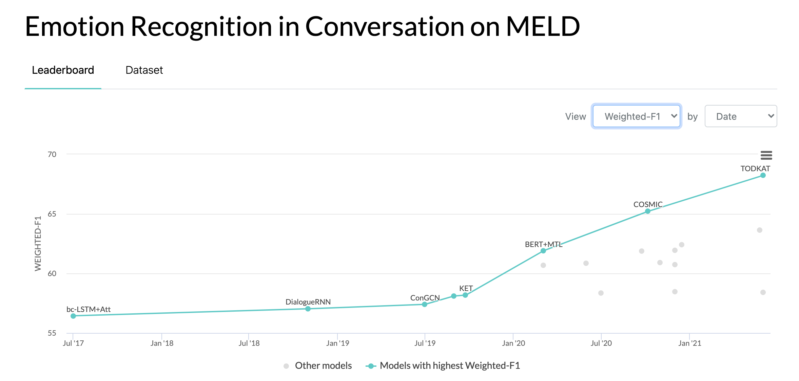
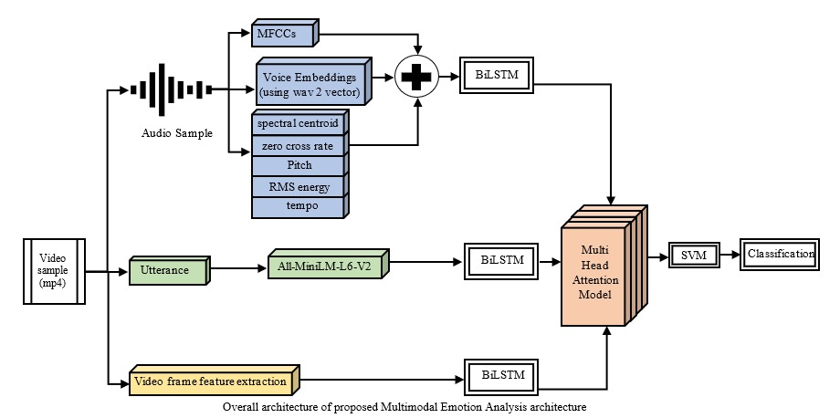
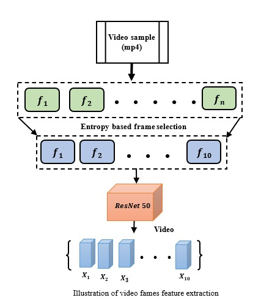
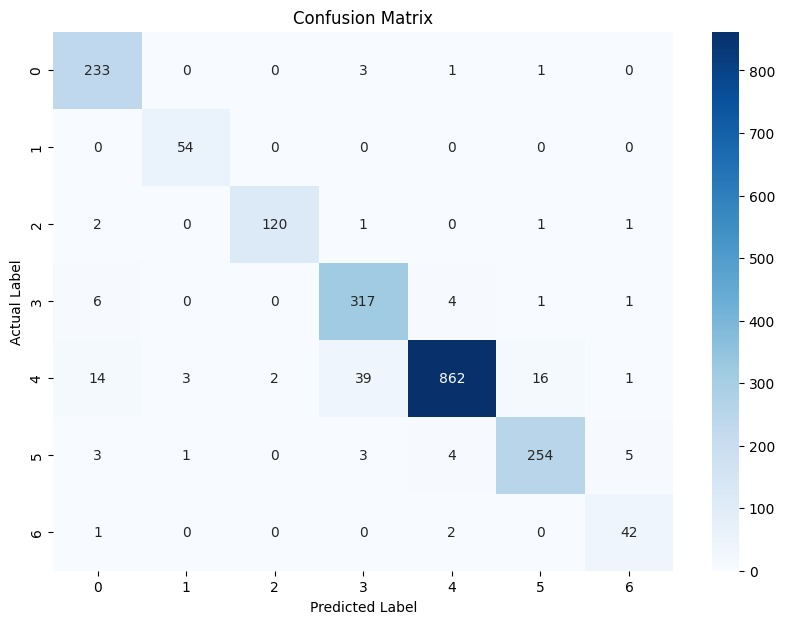
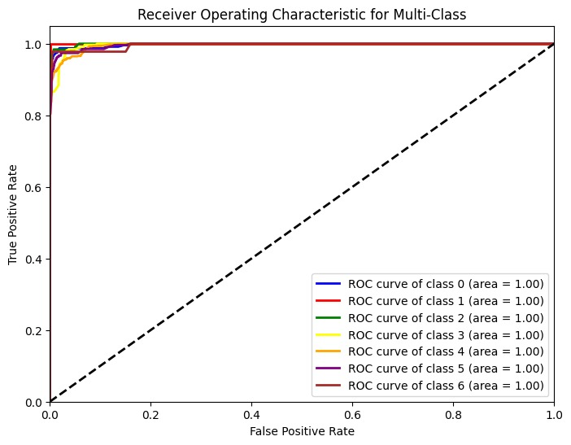

# Multimodal Emotion Analysis Using Attention-Based Neural Networks

This project aims to perform emotion analysis using the Multimodal EmotionLines Dataset (MELD). The dataset includes audio, text, and video data, allowing for comprehensive multimodal emotion recognition. The project utilizes advanced neural networks and machine learning techniques to process and analyze the data.

## Introduction

Multimodal emotion analysis is crucial for understanding human emotions in a more holistic manner by leveraging data from different modalities. This project uses the MELD dataset, which provides text, audio, and video data, to build a robust emotion recognition system using attention-based neural networks.

## Dependencies

### Python Version
Python 3.6+

### Python Libraries
The following Python libraries are required for this project:
- pandas
- numpy
- torch
- torchaudio
- torchvision
- transformers
- sentence-transformers
- scikit-learn
- matplotlib
- seaborn
- opencv-python
- librosa

### Pre-trained Models
The project uses the following pre-trained models:
- Wav2Vec 2.0: `facebook/wav2vec2-base-960h`
- ResNet-50: From `torchvision.models`
- all-MiniLM-L6-v2: From `sentence-transformers`

### Installation
You can install all the required packages and pre-trained models using the provided **requirements.txt** file and the following code snippets.

#### requirements.txt
```txt
pandas
numpy
torch==2.1.2
torchaudio
torchvision
transformers
sentence-transformers
scikit-learn
matplotlib
seaborn
opencv-python
librosa==0.10.1
```

## Installation Command

### 1) Install Python Libraries:
```bash
pip install -r requirements.txt
```

### 2) Download Pre-trained Models:
```python
from transformers import Wav2Vec2Processor, Wav2Vec2Model
from sentence_transformers import SentenceTransformer
import torchvision.models as models

# Wav2Vec 2.0
voice_processor = Wav2Vec2Processor.from_pretrained("facebook/wav2vec2-base-960h")
voice_model = Wav2Vec2Model.from_pretrained("facebook/wav2vec2-base-960h")

# ResNet-50
resnet50 = models.resnet50(weights=models.ResNet50_Weights.DEFAULT)

# all-MiniLM-L6-v2
text_model = SentenceTransformer('all-MiniLM-L6-v2')
```

By following these steps, you can ensure that all the necessary dependencies and pre-trained models for the project are installed correctly.

## MELD: A Multimodal Multi-Party Dataset for Emotion Recognition in Conversation



### Introduction
The Multimodal EmotionLines Dataset (MELD) has been created by enhancing and extending the EmotionLines dataset. MELD contains the same dialogue instances available in EmotionLines, but it also encompasses audio and visual modality along with text. MELD has more than 1400 dialogues and 13000 utterances from the Friends TV series. Multiple speakers participated in the dialogues. Each utterance in a dialogue has been labeled by any of these seven emotions -- Anger, Disgust, Sadness, Joy, Neutral, Surprise, and Fear. MELD also has sentiment (positive, negative, and neutral) annotation for each utterance.


#### Dataset Statistics
| Statistics                     | Train | Dev | Test |
|--------------------------------|-------|-----|------|
| # of modality                  | {a,v,t} | {a,v,t} | {a,v,t} |
| # of unique words              | 10,643 | 2,384 | 4,361 |
| Avg. utterance length          | 8.03  | 7.99 | 8.28  |
| Max. utterance length          | 69    | 37  | 45    |
| Avg. # of emotions per dialogue| 3.30  | 3.35| 3.24  |
| # of dialogues                 | 1039  | 114 | 280   |
| # of utterances                | 9989  | 1109| 2610  |
| # of speakers                  | 260   | 47  | 100   |
| # of emotion shift             | 4003  | 427 | 1003  |
| Avg. duration of an utterance  | 3.59s | 3.59s | 3.58s |

#### Dataset Distribution
|         | Train | Dev | Test |
|---------|-------|-----|------|
| Anger   | 1109  | 153 | 345  |
| Disgust | 271   | 22  | 68   |
| Fear    | 268   | 40  | 50   |
| Joy     | 1743  | 163 | 402  |
| Neutral | 4710  | 470 | 1256 |
| Sadness | 683   | 111 | 208  |
| Surprise| 1205  | 150 | 281  |

## System Architecture

The system architecture for this project comprises three main pipelines: audio, text, and video, which are integrated to perform multimodal emotion analysis. Below is a detailed description of each component and how they interact within the overall system.

### Audio Pipeline

1. **Audio Sample Extraction**: Extract audio from video samples (mp4 format).
2. **Feature Extraction**:
   - **Voice Embeddings**: Using Wav2Vec2 model to get a vector representation.
   - **MFCCs**: Extracting Mel-frequency cepstral coefficients.
   - **Spectral Centroid**: Calculating the spectral centroid.
   - **Zero Crossing Rate**: Measuring the rate of zero crossings.
   - **Pitch**: Extracting the pitch of the audio.
   - **RMS Energy**: Calculating root mean square energy.
   - **Tempo**: Measuring the tempo of the audio.
3. **Combination and BLSTM**:
   - Combine all extracted features.
   - Pass the combined features through a Bidirectional Long Short-Term Memory (BLSTM) network.

### Text Pipeline

1. **Utterance Extraction**: Extract text utterances from the video samples.
2. **Text Embeddings**:
   - Use the all-MiniLM-L6-v2 model to obtain vector embeddings for the text.
3. **BLSTM**:
   - Pass the text embeddings through a BLSTM network.

### Video Pipeline

1. **Frame Extraction**:
   - Extract frames from the video sample.
   - Use entropy-based frame selection to choose the top 10 most informative frames.
2. **Feature Extraction**:
   - Use a ResNet-50 model to extract features from the selected frames.
   - Each frame is converted into a 512-dimensional vector.
3. **BLSTM**:
   - Pass the frame features through a BLSTM network.

### Integration and Classification

1. **Multi-Head Attention Model**:
   - Combine features from the audio, text, and video pipelines.
   - Use a Multi-Head Attention model to integrate the features.
2. **Classification**:
   - Pass the integrated features to an SVM classifier for final emotion classification.

Below are the illustrations of the architecture:

1. **Overall Architecture of the Proposed Multimodal Emotion Analysis**:
   


2. **Illustration of Video Frames Feature Extraction**:
   


These image visually depict the data flow and processing steps involved in the system, highlighting the integration of audio, text, and video features for effective emotion analysis.

## Output

The following section describes the output of the project, including the accuracy metrics, confusion matrix, ROC curves, and other relevant statistics.

#### SVM Classification Metrics

- **SVM Accuracy**: 0.9419
- **Precision**: 0.9208
- **Recall**: 0.9566
- **F1-Score**: 0.9374

These metrics indicate the performance of the SVM classifier used in the final stage of the emotion analysis model. High values across these metrics demonstrate the model's effectiveness in classifying emotions.

#### Training Metrics

The training process involved running the model for 9988 epochs, with loss values progressively decreasing. The final training metrics are:

- **Epoch 9941/9988, Loss**: 0.1220598965883255
- **Epoch 9951/9988, Loss**: 0.12162306159734726
- **Epoch 9961/9988, Loss**: 0.11883553117513657
- **Epoch 9971/9988, Loss**: 0.1161361038684845
- **Epoch 9981/9988, Loss**: 0.11568349599838257

The training completed in approximately 25175.94 seconds (around 7 hours).

#### Model Summary

The model architecture includes several components such as BiLSTM layers for voice, text, and video features, a multi-head attention mechanism, and a fully connected layer for classification. The model summary is as follows:

```text
EmotionAnalysisModel(
  (bilstm_voice): LSTM(512, 256, batch_first=True, bidirectional=True)
  (bilstm_text): LSTM(512, 256, batch_first=True, bidirectional=True)
  (bilstm_video): LSTM(512, 256, batch_first=True, bidirectional=True)
  (multihead_attention): MultiheadAttention(
    (out_proj): NonDynamicallyQuantizableLinear(in_features=512, out_features=512, bias=True)
  )
  (fc): Linear(in_features=512, out_features=7, bias=True)
  (project_V3): Linear(in_features=25, out_features=512, bias=True)
  (project_V4): Linear(in_features=25, out_features=512, bias=True)
)
```

- **Trainable Parameters**: 22.18 MB (5,813,255 parameters)

#### Confusion Matrix

The confusion matrix provides insight into the classification performance across different emotion categories. The matrix is visualized using a heatmap:



#### ROC Curves and AUC

ROC curves are plotted for each emotion class to evaluate the model's ability to distinguish between different emotions. The AUC values provide a measure of the model's performance:



#### Model Size and Parameters

- **Model Size on Disk**: 22.19 MB
- **Number of Trainable Parameters**: 5,813,255

These details indicate the model's footprint and complexity.

#### Emotion Classification Results

A detailed breakdown of the classification results for each emotion, including the total number of instances, correctly classified instances, and percentage accuracy, is provided:

```text
Emotion classification results:
    Emotion  Total  Correct  Wrong   % Correct
0     anger    238      233      5   97.899160
1   disgust     54       54      0  100.000000
2   sadness    125      120      5   96.000000
3       joy    329      317     12   96.352584
4   neutral    937      862     75   91.995731
5  surprise    270      254     16   94.074074
6      fear     45       42      3   93.333333
```

This table summarizes the performance of the emotion analysis model for each emotion category.

By providing these detailed metrics and visualizations, the output section offers a comprehensive overview of the model's performance and effectiveness in multimodal emotion analysis.

## Usage Instructions

### Running the Scripts

To run the scripts for each pipeline, follow these steps:

1. **Audio Pipeline**:\
    Execute `Audio_vector.py` to extract audio features and save them to an Excel file.

2. **Text Pipeline**:\
    Execute `Text_vector.py` to extract text features and save them to an Excel file.

3. **Video Pipeline**:\
   Execute `Video_vector.py` to extract video features and save them to an Excel file.

4. **Training and Evaluation**:\
    Execute `Multihead_attention_NN.py` to train the model and evaluate its performance.


